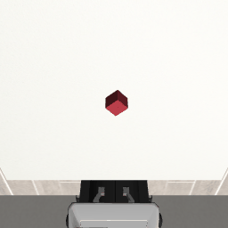

# DiffuseManip

From-scratch implementation of **Diffusion Policy** (Chi et al., 2023) for robotic manipulation, built on robosuite + robomimic. Achieves **100% success rate on Lift** (50/50 rollouts) with a low-dimensional observation policy trained from scratch on a single CPU.



## Results

| Task | Success Rate | Avg Episode Length | Baseline (BC-RNN) |
|------|-------------|-------------------|-------------------|
| Lift | **100%** (50/50) | 54 steps (2.7s) | 94% |
| Can  | coming soon | — | 65% |
| Square | coming soon | — | 26% |

Evaluated with 50 rollouts per task, randomized cube placement, 20 Hz control.

## What is Diffusion Policy?

Standard behavioral cloning learns a deterministic mapping from observation to action. This fails when expert demonstrations are **multimodal** — e.g., the expert sometimes grasps from the left, sometimes from the right. A deterministic policy averages these modes and predicts an action straight through the object.

Diffusion Policy instead learns a *distribution* over actions by reversing a noise process (the same mechanism as DALL-E / Stable Diffusion). At inference, it starts from Gaussian noise and iteratively denoises into a coherent action sequence conditioned on the current observation. This lets it represent and sample from multiple valid strategies.

Key design choices in this implementation:
- **1-D temporal U-Net** operating over the action horizon axis (not image spatial axes)
- **FiLM conditioning** — observation embedding modulates every residual block via learned scale + shift
- **DDPM training** (ε-prediction, 100 steps), **DDIM inference** (16 steps, deterministic)
- **Receding-horizon control**: predict Tp=16, execute Ta=8, replan

## Architecture

```
Observation (To=2 frames, 19-dim)
        │
        ▼
  LowDimEncoder
  Linear → SiLU → Linear
        │
        ▼ obs_cond (256-dim)
        │
        ├────────────────────────────────┐
        │                                │
        ▼                                │
  Noisy actions (Tp=16, 7-dim)    Timestep embedding
        │                                │
        └──────────┬─────────────────────┘
                   │
                   ▼
         ConditionalUNet1D
         ┌─────────────────────┐
         │ Encoder             │
         │  ResBlock(7→256)    │
         │  Downsample ↓2      │
         │  ResBlock(256→512)  │
         │  Downsample ↓2      │
         │  Bottleneck(512→1024│
         │ Decoder             │
         │  Upsample ↑2 + skip │
         │  ResBlock(1024→512) │
         │  Upsample ↑2 + skip │
         │  ResBlock(512→256)  │
         │  Final(256→7)       │
         └─────────────────────┘
                   │
                   ▼
         Predicted noise ε̂
```

Each ResBlock applies FiLM conditioning from the concatenated (timestep, obs) vector.

## Setup

**Requirements**: Windows/Linux, Python 3.10, CUDA optional (trains on CPU in ~55 min/30 epochs).

```bash
conda create -n diffusemanip python=3.10
conda activate diffusemanip

pip install torch torchvision
pip install robosuite==1.5.2
pip install mujoco==2.3.7          # pin: 3.x breaks robosuite 1.5 OSC controller
pip install robomimic --no-deps    # --no-deps avoids Linux-only egl_probe on Windows
pip install h5py numpy
```

**Download the Lift dataset:**
```bash
python -m robomimic.scripts.download_datasets --tasks lift --dataset_types ph
```

## Usage

**Train:**
```bash
python train.py --hdf5 data/lift/ph/low_dim_v141.hdf5 --task Lift
# Resume from checkpoint:
python train.py --hdf5 data/lift/ph/low_dim_v141.hdf5 --task Lift --resume runs/<name>/last.ckpt
```

**Evaluate:**
```bash
python eval.py --checkpoint runs/<name>/best.ckpt --task Lift --n-rollouts 50
# Save rollout GIFs:
python eval.py --checkpoint runs/<name>/best.ckpt --task Lift --n-rollouts 3 --save-videos
```

**Run tests:**
```bash
python test_windowing.py          # data pipeline unit tests (no deps beyond numpy)
python test_diffusion_policy.py   # model architecture unit tests (PyTorch only)
```

## Files

| File | Description |
|------|-------------|
| `datasets.py` | HDF5 data loader, sliding-window sampler, per-dimension normalizer |
| `obs_encoders.py` | LowDimEncoder (MLP); ImageEncoder stub for M2 |
| `diffusion_policy.py` | SinusoidalPosEmb, ResidualBlock1D (FiLM), ConditionalUNet1D, GaussianDiffusion, DDIM |
| `train.py` | Training loop with EMA, AdamW, checkpointing, optional W&B |
| `eval.py` | Rollout harness: receding-horizon control, success detection, GIF export |
| `test_windowing.py` | 8-check unit tests for the data pipeline |
| `test_diffusion_policy.py` | 8-check unit tests for the model (shapes, gradients, DDIM) |
| `demo_diffusion.py` | Animated GIF of DDIM denoising mechanism (model architecture demo) |

## Key Implementation Notes

**Observation space** (19-dim, concatenated in order):
- `object`: cube position (3) + cube quaternion (4) + eef-to-cube vector (3) = 10-dim
- `robot0_eef_pos`: end-effector position (3)
- `robot0_eef_quat`: end-effector orientation (4)
- `robot0_gripper_qpos`: gripper joint positions (2)

**Action space**: 7-dim OSC_POSE — (ΔX, ΔY, ΔZ, Δroll, Δpitch, Δyaw, gripper)

**Hyperparameters** (paper defaults):
- Pred horizon Tp=16, obs horizon To=2, action horizon Ta=8
- DDPM T=100, DDIM steps=16 at inference
- AdamW lr=1e-4, batch=256, grad clip=1.0
- EMA decay=0.999

## Bugs Fixed Along the Way

| Bug | Symptom | Fix |
|-----|---------|-----|
| EMA decay too high (0.9999) | 75% of shadow was random init → 2% success | Lower to 0.999; auto-detect and skip bad EMA in eval |
| robosuite 1.4 vs 1.5 obs sign flip | `object-state` dims 7-9 have opposite sign → OOD inputs | Negate dims 7-9 in `extract_obs()` |
| mujoco 3.x API break | `mj_fullM` signature changed, OSC controller crashes | Pin `mujoco==2.3.7` |
| PyTorch 2.6 `weights_only` default | Checkpoint load fails with numpy arrays | Add `weights_only=False` |
| robosuite 1.5 `load_controller_config` moved | ImportError on eval startup | Remove import; `suite.make()` uses default config automatically |
| Windows Smart App Control | `mujoco.dll` blocked (WinError 4551) | Disable SAC in Windows Security settings |

## Roadmap

- [x] M0: Environment setup (robosuite + robomimic + MuJoCo)
- [x] M1a: Diffusion Policy on Lift, low-dim obs — **100% success**
- [ ] M1b: Diffusion Policy on Can and Square
- [ ] M2: Image observations (spatial-softmax ResNet-18 encoder)

## Reference

Chi, C., Feng, S., Du, Y., Xu, Z., Cousineau, E., Burchfiel, B., & Song, S. (2023).
*Diffusion Policy: Visuomotor Policy Learning via Action Diffusion.*
RSS 2023. [arXiv:2303.04137](https://arxiv.org/abs/2303.04137)
